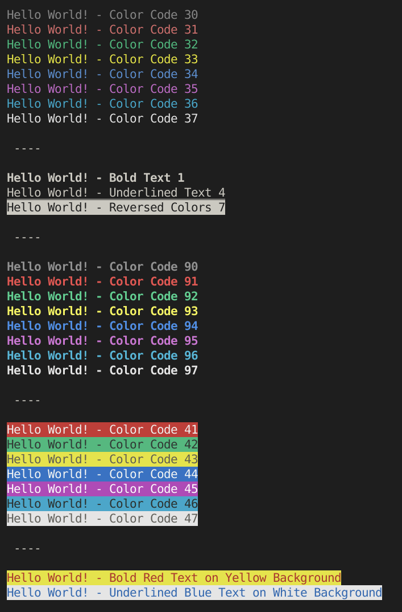

## Comunity
Don't hesitate to add proposals in C or other languages to further explore colorization techniques in terminal applications. Contributions are welcome!

# Terminal Colorization in C

This project demonstrates how to add colors and styles to terminal outputs in C using ANSI escape codes. The code provides a variety of color and style options, enabling more readable and visually appealing command-line interactions.

## The Importance of Adding Color to Terminal Outputs

In programming and system administration, terminal outputs are an essential part of interacting with the system, debugging, and understanding code behavior. Adding color to these outputs can significantly enhance readability, efficiency, and the user experience. Here are a few reasons why color in terminal outputs is beneficial:

## 1. Improved Readability

When outputs are color-coded, it becomes easier to distinguish between different types of information, such as:
- **Errors** (often red): Immediate attention to critical issues
- **Warnings** (often yellow): Noticeable but not as urgent as errors
- **Success Messages** (often green): Quick visual feedback on successful operations
- **Information Logs** (often blue or cyan): Important but not critical information

Color separation reduces the cognitive load required to interpret long outputs by allowing users to focus on specific sections quickly.

## 2. Faster Debugging and Issue Identification

In a typical debugging session, recognizing errors or warnings promptly is crucial. With color-coded outputs, developers can immediately locate problems in their code or system logs, saving time and increasing productivity. Errors and warnings are more likely to stand out, reducing the chances of missing important issues.

## 3. Enhanced User Experience

A colorful terminal output can make command-line interactions more engaging and less monotonous, especially in tools that developers use frequently. This small visual enhancement can make the overall experience more enjoyable and increase engagement with the tools.

## 4. Customization and Personalization

Many terminals and command-line tools allow users to customize colors, which can improve accessibility. For instance, users with color blindness can choose color schemes that are easier for them to differentiate, making the terminal a more inclusive and personalized environment.

## Implementing Color in Terminals

Color in terminal outputs can be implemented by using ANSI escape codes in languages like Python, JavaScript, C, bash and more. Libraries like `chalk` (for Node.js) or `colorama` (for Python) provide a simplified way to add colors without dealing with ANSI codes directly.